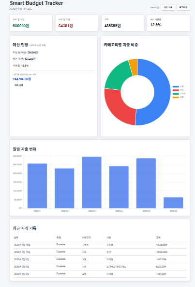
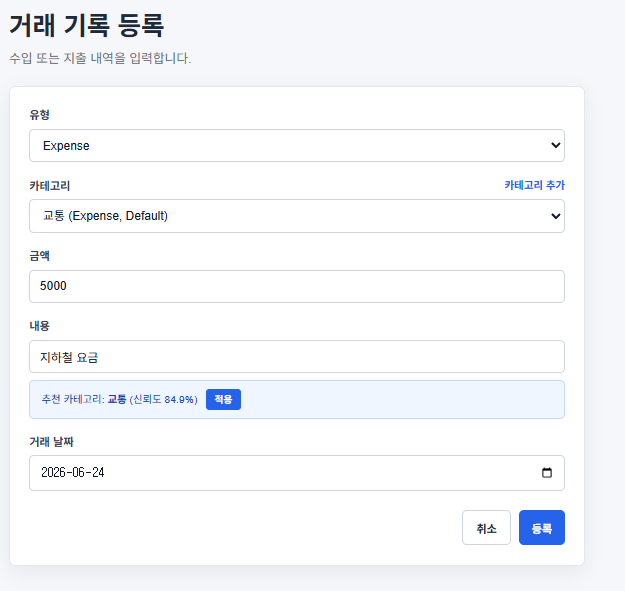
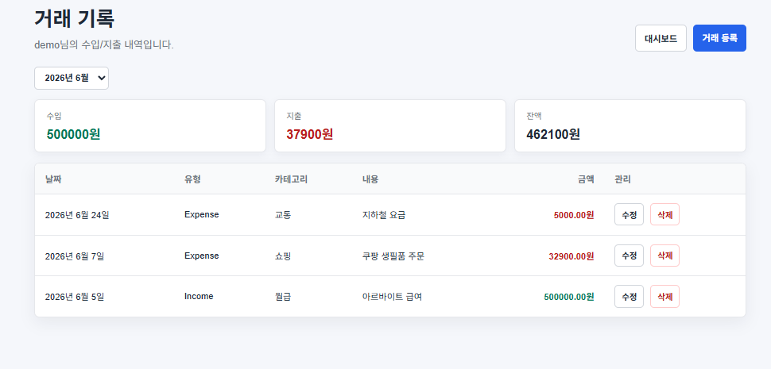

# Smart Budget Tracker

> 머신러닝 카테고리 추천과 지출 예측을 탑재한 개인 예산 관리 웹 애플리케이션


---

## 소개

수입/지출 CRUD, 카테고리 관리, 월별 차트 시각화에 **scikit-learn 머신러닝**을 직접 통합한 개인 예산 관리 앱입니다.

거래 설명 텍스트로 카테고리를 자동 추천하고, 선형 회귀로 다음 달 예상 지출을 예측합니다.
구현 후 **측정 → 원인 분석 → 개선** 사이클을 직접 경험하며 3가지 성능 지표를 수치로 검증했습니다.

---

## 스크린샷

### 대시보드


### ML 카테고리 자동 추천
거래 내용 입력 시 TF-IDF + LinearSVC로 카테고리를 실시간 추천합니다.



### 거래 목록


---

## 주요 기능

- **수입/지출 관리** — CRUD, 월별 필터, 카테고리 분류
- **ML 카테고리 추천** — 거래 설명 텍스트 기반 자동 추천 (신뢰도 % 표시)
- **지출 예측** — 과거 월별 데이터를 선형 회귀로 학습해 다음 달 지출 예측
- **시각화** — Chart.js 도넛 차트(카테고리별 비중) + 막대 차트(월별 추이)
- **예산 관리** — 월별 예산 설정 및 사용률 트래킹
- **회원 인증** — 세션 기반 로그인, 이메일 유효성 + 중복 검사

---

## 기술 스택

| 구분 | 기술 |
|------|------|
| Language | Python 3.12 |
| Framework | Django 6.0 |
| Machine Learning | scikit-learn 1.9 (TF-IDF, LinearSVC, LinearRegression) |
| Data | numpy, pandas |
| Frontend | Chart.js 4.4.1, Bootstrap |
| DB | SQLite |
| Server | Gunicorn + WhiteNoise |
| Dev Tools | Claude AI, OpenAI Codex |

---

## 성능 개선 이력

구현 후 측정을 통해 발견한 3가지 병목을 개선했습니다.

| 지표 | 개선 전 | 개선 후 | 방법 |
|------|--------|--------|------|
| ML 추천 정확도 | 40.4% | **70.8%** | 학습 데이터 37→500개, LinearSVC 전환, class_weight='balanced' |
| AJAX 추천 응답 | 394ms | **8ms** | 파이프라인 메모리 캐시, 데이터 변경 시에만 재학습 |
| 대시보드 DB 쿼리 | 6개 | **4개** | Django 조건부 집계 (`Sum with filter=Q(...)`) |

---

## ML 파이프라인

```
거래 설명 입력 → TF-IDF (char n-gram 1~4) → LinearSVC 분류 → 카테고리 추천 + 신뢰도(%)
```

- `analyzer="char_wb"`, `ngram_range=(1, 4)`, `sublinear_tf=True`
- `CalibratedClassifierCV`로 신뢰도(확률) 출력
- `class_weight="balanced"`로 클래스 불균형 보정
- Cross-Validation (5-fold Stratified) 정확도: **70.8%**
- 응답 시간: **8ms** (파이프라인 캐시 적용)

---

## 로컬 실행

```bash
git clone https://github.com/KimGyeongMinB/budget-tracker-django.git
cd budget-tracker-django

python -m venv .venv
source .venv/bin/activate  # Windows: .venv\Scripts\activate

pip install -r requirements.txt

python manage.py migrate
python manage.py seed        # 샘플 데이터 + ML 학습 데이터 500개 생성
python manage.py runserver
```

접속: http://127.0.0.1:8000  
데모 계정: `demo` / `demo1234`

---

## 프로젝트 구조

```
smart-budget-tracker/
├── budgets/
│   ├── models.py          # TransactionRecord, Category, Budget, MLCategoryTrainingData
│   ├── views.py           # CRUD + ML 추천 AJAX 뷰
│   ├── ml.py              # TF-IDF + LinearSVC 파이프라인, 선형 회귀 예측
│   ├── forms.py           # 폼 유효성 검사
│   └── management/
│       └── commands/
│           └── seed.py    # 샘플 데이터 생성 커맨드
├── templates/
├── static/
└── config/
    └── settings.py
```

---

## 개발 방식

Claude AI와 OpenAI Codex를 개발 보조 도구로 활용했습니다.
기능 결정, ML 모델 선정, 성능 개선 방향 판단은 직접 수행하고, AI는 코드 구체화 역할을 담당했습니다.
